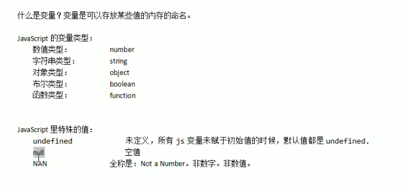
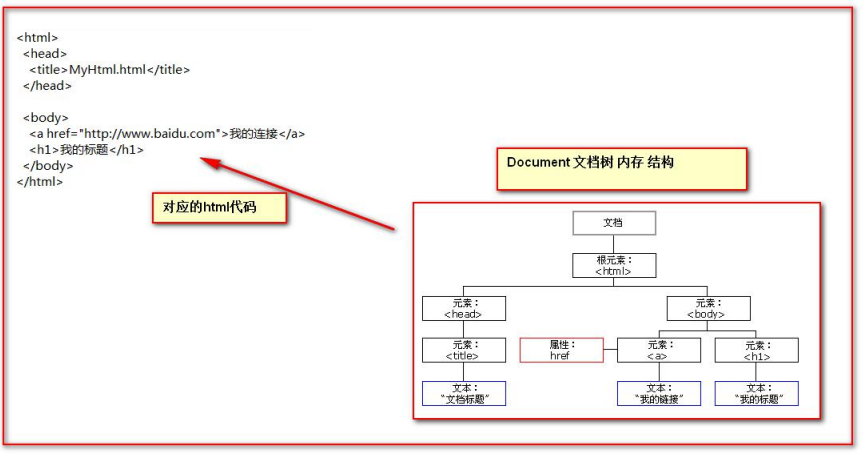
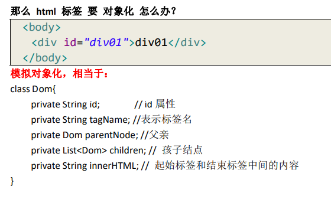

# JavaScript

## JavaScript特点

JavaScript是一种基于对象(Object)和事件驱动(EventDriven)
并具有安全性能的脚本语言。使用它的目的是与HTML超文本标记语言、Java脚本语言（Java小程序）一起实现在一个Web页面中连接多个对象，与Web客户交互作用。从而可以开发客户端的应用程序等。它是通过嵌入或调入到标准的HTML语言中实现的。它的出现弥补了HTML语言的缺陷，它是Java与HTML折衷的选择，具有以下几个基本JavaScript特点：

1. JavaScript是一种脚本编写语言

`
JavaScript是一种脚本语言，它采用小程序段的方式实现编程。像其它脚本语言一样,JavaScript同样已是一种解释性语言,它提供了一个易的开发过程。它的基本结构形式与C、C++、VB、Delphi十分类似。但它不像这些语言一样，需要先编译，而是在程序运行过程中被逐行地解释。它与HTML标识结合在一起，从而方便用户的使用操作。
`

2. 基于对象的语言

`
JavaScript是一种基于对象的语言，同时以可以看作一种面向对象的。这意味着它能运用自己已经创建的对象。因此，许多功能可以来自于脚本环境中对象的方法与脚本的相互作用。
`

3. 简单性

`
JavaScript的简单性主要体现在：首先它是一种基于Java基本语句和控制流之上的简单而紧凑的设计,从而对于学习Java是一种非常好的过渡。其次它的变量类型是采用弱类型，并未使用严格的数据类型。
`

4. 安全性

`
JavaScript特点之一它是一种安全性语言，它不允许访问本地的硬盘，并不能将数据存入到服务器上，不允许对网络文档进行修改和删除，只能通过浏览器实现信息浏览或动态交互。从而有效地防止数据的丢失。
`

5. 动态性的

`JavaScript特点之一它是动态的，它可以直接对用户或客户输入做出响应，无须经过Web服务程序。它对用户的反映响应，是采用以事件驱动的方式进行的。所谓事件驱动，就是指在主页(HomePage)中执行了某种操作所产生的动作，就称为“事件”(Event)。比如按下鼠标、移动窗口、选择菜单等都可以视为事件。当事件发生后，可能会引起相应的事件响应。
`

6. 跨平台性

`
JavaScript是依赖于浏览器本身，与操作环境无关，只要能运行浏览器的计算机，并支持JavaScript的浏览器就可正确执行。从而实现了“编写一次,走遍天下”的梦想。实际上JavaScript最杰出之处在于可以用很小的程序做大量的事。无须有高性能的电脑，软件仅需一个字处理软件及一浏览器，无须WEB服务器通道，通过自己的电脑即可完成所有的事情。
`

**综合所述JavaScript是一种新的描述语言，它可以被嵌入到HTML的文件之中。JavaScript语言可以做到回应使用者的需求事件(如：form的输入)
，而不用任何的网路来回传输资料，所以当一位使用者输入一项资料时，它不用经过传给伺服端(server)处理，再传回来的过程，而直接可以被客户端(client)的应用程式所处理。**

# JavaScript在HTML中的使用

1. 在HTML中直接写

```HTML

<script type="text/javascript">
    //第一种方式:直接使用
    //
    //alert 是JavaScript语言提供的一个警告框函数
    //他可以截杀任意类型的参数,这个参数就是警告框的提示信息
    alert("hello java script");
    alert(1111111);
    alert(1111111.2324);
    alert(true);
</script>
```

2. 另写一个js文件导入

```html

<head>
    <meta charset="UTF-8">
    <title>Title</title>
    <!--第二种使用方法:
        在HTML文件中导入外部的js文件来执行
            src属性专门用来引入外部的js文件路径(可以是相对路径,也可以是绝对路径)

        script标签可以用来定义js代码,也可以用来引入js文件
        但是两个功能二选一使用,不能同时使用两个功能
        虽然也可以执行,但是有先后顺序-->
    <script type="text/javascript" src="js/1.js"></script>
    <script type="text/javascript">
        alert("智障");
    </script>
</head>
```

## 变量



```javascript
    let i;//undefined
alert(i);
i = 212;
alert(typeof (i));
//typeof()是JavaScript语言提供的一个函数
i = "abc";
alert(typeof (i));
let a = 12;
let b = "asd";
alert(a * b);//输出非数值,NaN是非数字
```

## 关系运算

1. 等于 等于: == 简单的字面值的比较 全等于: === 除做字面值的比较外,还会比较两个标量的数据类型

```javascript
    let a = "12";
let b = 12;
alert(a == b);//true
alert(a === b);//false
```

2. 逻辑运算 且运算： && 或运算： || 取反运算： !

   **在 JavaScript 语言中，所有的变量，都可以做为一个 boolean 类型的变量去使用。0 、null、 undefined、””(空串) 都认为是 false；**

 ```JavaScript
 /*
   && 且运算。
   有两种情况：
   第一种：当表达式全为真的时候。返回最后一个表达式的值。
   第二种：当表达式中，有一个为假的时候。返回第一个为假的表达式的值|| 或运算
   第一种情况：当表达式全为假时，返回最后一个表达式的值
   第二种情况：只要有一个表达式为真。就会把回第一个为真的表达式的值并且 && 与运算 和 ||或运算 有短路。
   短路就是说，当这个&&或||运算有结果了之后 。后面的表达式不再执行*/
var a = "abc";
var b = true;
var d = false;
var c = null;
 ```

## 数组

JS 中 数组的定义： 格式： var 数组名 = []; // 空数组 var 数组名 = [1 , ’abc’ , true]; // 定义数组同时赋值元素

```javascript
     let arr0 = [1, "abc", true]; // 定义数组同时赋值元素
let arr = [];//定义一个空数组
alert(arr.length);//0
arr[0] = 12;
alert(arr[0]);
alert(arr.length);//1
arr[2] = "abc";
alert(arr[2]);//数组第一个位置和第二个位置有元素
alert(arr.length);//数组的长度就是三
alert(arr[1]);//undefined


for (let i = 0; i < arr.length; i++) {
    alert(arr[i]);//依次输出12,undefined,abc
}

```

## 函数

1. 第一种，可以使用 function 关键字来定义函数。

   使用的格式如下:

   function 函数名(形参列表){

   函数体

   }

在 JavaScript 语言中，如何定义带有返回值的函数？ 只需要在函数体内直接使用 return 语句返回值即可！

2. 函数的第二种定义方式，格式如下：

   使用格式如下：

   var 函数名 = function(形参列表) { 函数体 }

**注：在 Java 中函数允许重载。但是在 JS 中函数的重载会直接覆盖掉上一次的定义**

## 函数的 arguments 隐形参数（只在 function 函数内）

就是在 function 函数中不需要定义，但却可以直接用来获取所有参数的变量。我们管它叫隐形参数。隐形参数特别像 java 基础的可变长参数一样。

public void fun( Object ... args );

可变长参数其他是一个数组。

那么 js 中的隐形参数也跟 java 的可变长参数一样。操作类似数组。

```javascript
function fun() {
    alert(arguments.length);//3
    alert(arguments[0]);//1
    alert(arguments[1]);//as
    alert(arguments[2]);//true
    alert(arguments[3]);//undefined
    alert("无参函数fun()");
    alert(arguments.length);//3
}

// fun(1,"as",true);

function sum(num1, num2) {
    var result;//如果此时不对result赋值,那么,就会输出NAN
    result = "";//
    for (var i = 0; i < arguments.length; i++) {
        if (typeof (arguments[i]) == "string") {
            result += arguments[i];
        }//如果此时不对typeof进行判断,就是简单的字符串拼接
    }
    return result;
}

alert(sum(1, 2, 3, 4, "abc", 5, 6, "de", 7, 8, 9, true));
```

## js中的自定义对象

1. Object 形式的自定义对象

```javascript
   //对象的定义
   //  let 变量名 = new Object();
   //  变量名.属性名 = 值;
   //  变量名.函数名 = function(){}
let obj = new Object();
obj.name = "华仔";
obj.age = 18;
obj.fun = function () {
    alert("姓名:" + this.name + ",年龄:" + this.age);
}
alert(obj.age);
obj.fun();
```

2. {}花括号形式的自定义对象<br>
   对象的定义：<br>
   var 变量名 = { // 空对象<br>
   属性名：值, // 定义一个属性<br>
   属性名：值, // 定义一个属性<br>
   函数名：function(){} // 定义一个函数<br>
   };<br>
   对象的访问：<br>
   变量名.属性 / 函数名();<br>

```javascript
     let obj = {
    name: "ykn",//注意这里是冒号和逗号,而不是等于和分号
    age: 18,
    fun: function () {
        alert(123);
        return 321;
    }
}
alert(obj.fun());
alert(obj.name);
//依次输出123,321,ykn
```

## js中的事件

**什么是事件？事件是电脑输入设备与页面进行交互的响应。我们称之为事件。<br>常用的事件：<br>
onload 加载完成事件： 页面加载完成之后，常用于做页面js 代码初始化操作<br>onclick 单击事件： 常用于按钮的点击响应操作。<br>onblur 失去焦点事件： 常用用于输入框失去焦点后验证其输入内容是否合法。<br>
onchange 内容发生改变事件： 常用于下拉列表和输入框内容发生改变后操作<br>onsubmit 表单提交事件： 常用于表单提交前，验证所有表单项是否合法。**
<br><br>事件的注册又分为静态注册和动态注册两种：什么是事件的注册（绑定）？<br>
其实就是告诉浏览器，当事件响应后要执行哪些操作代码，叫事件注册或事件绑定。<br>静态注册事件：通过 html 标签的事件属性直接赋于事件响应后的代码，这种方式我们叫静态注册。
<br>动态注册事件：是指先通过 js 代码得到标签的 dom 对象，然后再通过 dom 对象.事件名= function(){} 这种形式赋于事件响应后的代码，叫动态注册。
<br>动态注册基本步骤：<br>
1、获取标签对象<br>
2、标签对象.事件名 = function(){}<br>

### 1.onload加载完成事件

```html
<!DOCTYPE html>
<html lang="en">
<head>
    <meta charset="UTF-8">
    <title>Title</title>
    <script type="text/javascript">
        //onload事件的方法
        function onloadFun() {
            alert('静态注册事件,所有代码');
        }

        //onload事件动态注册,是固定写法
        window.onload = function () {
            alert("动态注册的onload事件");
        }//静态注册完后动态不执行
    </script>
</head>
<!--静态注册onload事件
        onload事件是浏览器解析完页面之后就自动触发的事件
        <body onload="onloadFun();">
        -->
<body onload="onloadFun();">
</body>
</html>
```

### 2.onclick事件

```html
<!DOCTYPE html>
<html lang="en">
<head>
    <meta charset="UTF-8">
    <title>Title</title>
    <script type="text/javascript">
        function onclickFun() {
            alert("静态注册onclick事件");
        }

        //动态注册onclick事件
        window.onclick = function () {
            //1. 获取标签对象
            /*
             * document 是JavaScript语言提供的一个对象
             * get      获取
             * Element  元素
             * By       通过
             * Id       id属性
             *
             * getElementById 通过id属性获取标签对象
             */

            let btnObj = document.getElementById("btn1");
            btnObj.onclick = function () {
                alert("动态注册的onclick事件");
            }
        }
    </script>
</head>
<body>
<button onclick="onclickFun()">按钮1</button>
<button id="btn1">按钮2</button>
</body>
</html>
```

### onblur

```html
<!DOCTYPE html>
<html lang="en">
<head>
    <meta charset="UTF-8">
    <title>Title</title>
    <script type="text/javascript">
        //静态注册失去焦点事件
        function onblurFun() {
            //console是控制台对象,是由JavaScript语言提供,专门用来浏览器的打印
            console.log("静态注册失去焦点事件");
        }

        window.onload = function () {
            //1.获取标签对象
            let passwordObj = document.getElementById("password");
            //2.通过对象.事件名 = function(){}
            passwordObj.onblur = function () {
                console.log("动态注册失去焦点事件");
            }
        }
    </script>
</head>
<body>
用户名:<input type="text" onblur="onblurFun();"> <br>
密码 : <input id="password" type="password"><br>
</body>
</html>
```

### onchange

```html
<!DOCTYPE html>
<html lang="en">
<head>
    <meta charset="UTF-8">
    <title>Title</title>
    <script type="text/javascript">
        function onchangeFun() {
            alert("女神已经改变了");
        }

        window.onload = function () {
            let selObj = document.getElementById("sel01");
            selObj.onchange = function () {
                alert("男神已经改变了");
            }

        }
    </script>
</head>
<body>
请选择你心中的女神:
<select onchange="onchangeFun()">
    <option>--女神--</option>
    <option>1</option>
    <option>2</option>
    <option>3</option>

</select>
<br>
请选择你心中的男神:
<select id="sel01">
    <option>--男神--</option>
    <option>4</option>
    <option>5</option>
    <option>6</option>
</select>
</body>
</html>
```

### onsubmit

```html
<!DOCTYPE html>
<html lang="en">
<head>
    <meta charset="UTF-8">
    <title>Title</title>
    <script type="text/javascript">
        //静态注册表单提交事务
        function onsubmitFun() {
            //村验证所有表单项是否合法,如果又一个不合法就阻止表单提交
            alert("静态注册表单提交事件---发现不合法");
            return false;
        }

        window.onload = function () {
            let formObj = document.getElementById("form01");
            formObj.onsubmit = function () {
                alert("动态注册不合法");
            }
        }
    </script>
</head>
<body>
<form action="http://localhost:8080" method="get" onsubmit="return onsubmitFun();">
    <input type="submit" value="静态注册">
</form>
<form action="http://localhost:8080" method="get" id="form01">
    <input type="submit" value="动态注册">
</form>
</body>
</html>
```

## DOM模型

DOM模型是Document Object Model 文档对象模型<br>
**就是把文档中的属性,标签,文本,转换为对象来管理**

1. Document对象
   
   <br>
   对Document对象的理解

> 第一点:Document他管理了所有的HTML文档内容<br>
> 第二点:它是一种树结构的文档,有层级关系<br>
> 第三点:他让我们把所有标签都对象化<br>
> 第四点:我们可以通过document访问所有的标签对象<br>

<br>
标签对象化示例



* 小扩展

```javascript
//表示字符串中是否包含字母e
// let patt = new RegExp("e");
let patt = /e/;//也是正则表达式对象
// alert(patt);

//查找方括号之间的任何字符
patt = /[abc]/;
//表示要求字符串是否包含任意小写字母
patt = /[a-z]/;
//表示要求字符串中是否包含任意的大写字母
patt = /[A-Z]/;
//要求表示字符串,是否包含字母,数字,下划线_
patt = /\w/;
//表示要求字符串中是否包含至少一个a
patt = /a+/;
//表示要求字符串中是否包含零个或者多个a
patt = /a*/;
//表示要求字符串是否包含一个或零个a
patt = /a?/;
//表示要求 字符串中是否包含连续三个a
patt = /a{3}/;
//表示要求 字符串是否包含至少三个连续的a,至多五个连续的a
patt = /a{3,5}/;//"2daaaaaavasv"还是true,因为它有包含了
//表示是否包含至少3个连续a
patt = /a{3,}/;
//表示要求字符串必须以a结尾
patt = /a$/;
//表示要求字符串必须以a开头
patt = /^a/;
//  /a{3,5}/  如果要求从头到尾匹配
patt = /^a{3,5}$/;//aaa,aaaa,aaaaa才匹配
//要求从头到尾都是字母,下划线,数字,且长度介于5到12之间
patt = /^\w{5,12}$/;//如果去掉^和$,那么"advbaa[["就true了
alert(patt.test("advbaa[["));
```

### getElementById 方法实例

```html
<!DOCTYPE html>
<html lang="en">
<head>
    <meta charset="UTF-8">
    <title>Title</title>
    <script type="text/javascript">
        /*
        * 需求:当用户点击了校验按钮,要获取输入框里的内容,然后验证其合法性
        * 验证的规则是:必须由字母,数字,下划线组成,并且长度是5到12位.
        * */
        function onclickFun() {
            //当我们操作一个标签的时候,一定要先获取这一个对象
            let usernameObj = document.getElementById("username");
            let usernameSpan = document.getElementById("usernameSpan");
            //innerHTML表示其实标签和结束标签中的内容
            //innerHTML 这个属性可读可写
            // usernameSpan.innerHTML = "哈哈";
            // alert(usernameSpan.innerHTML);
            // alert(usernameObj.value);
            let usernameText = usernameObj.value;
            //如何验证字符串,需要用到正则表达式
            let patt = /^\w{5,12}$/;
            //test()测试某个字符串,是不是匹配规则
            if (patt.test(usernameText)) {
                // usernameSpan.innerHTML = "合法";
                usernameSpan.innerHTML = "";
            } else {
                usernameSpan.innerHTML = "";
            }
        }
    </script>
</head>
<body>
用户名:<input type="text" id="username" value="ykn"/>
<span id="usernameSpan" style="color:red ;"> </span>
<button onclick="onclickFun()">校验</button>
</body>
</html>
```

### getElementsByName 方法

getElementByName根据指定标签对象属性返回多个标签对象集合<br>
**这个集合的操作和数组一样<br>
集合中每个元素都是dom对象<br>
这个集合中的元素顺序是他们在HTML中从上到下的顺序**<br>
checked表示复选框的选中状态,如果选中时true,不选中时false<br>
checked属性可读可写

```html
<!DOCTYPE html>
<html lang="en">
<head>
    <meta charset="UTF-8">
    <title>Title</title>
    <script type="text/javascript">
        // getElementByName根据指定标签对象属性返回多个标签对象集合
        // 这个集合的操作和数组一样
        // 集合中每个元素都是dom对象
        // 这个集合中的元素顺序是他们在HTML中从上到下的顺序
        function checkAll() {
            let hobbies = document.getElementsByName("hobby");
            // alert(hobbies.length);
            // checked表示复选框的选中状态,如果选中时true,不选中时false
            // checked属性可读可写
            for (let i = 0; i < hobbies.length; i++) {
                hobbies[i].checked = true;
            }
            // alert(hobbies[0].checked);
        }

        function checkNo() {
            let hobbies = document.getElementsByName("hobby");
            for (let i = 0; i < hobbies.length; i++) {
                hobbies[i].checked = false;
            }
        }

        function checkReverse() {
            let hobbies = document.getElementsByName("hobby");
            for (let i = 0; i < hobbies.length; i++) {
                hobbies[i].checked = !hobbies[i].checked;
            }
        }
    </script>
</head>
<body>
兴趣爱好:
<input type="checkbox" name="hobby" value="cpp" checked="checked">C++
<input type="checkbox" name="hobby" value="java">Java
<input type="checkbox" name="hobby" value="js">JavaScript
<br>
<button onclick="checkAll()">全选</button>
<button onclick="checkNo()">全不选</button>
<button onclick="checkReverse()">反选</button>

</body>
</html>
```

### getElementByTagName 通过标签名查询

```javascript
     //全选
function checkAll() {
    //document.getElementsByTagName("input") 是根据指定标签名进行查询并返回集合
    //这个集合的操作和数组一样
    //集合中都是dom对象
    //集合中元素顺序是他们在HTML中从上到下的顺序
    let inputs = document.getElementsByTagName("input");
    // alert(inputs)
    for (let i = 0; i < inputs.length; i++) {
        inputs[i].checked = true;
    }
}
```

**!!!注意** <br>
document对象的三个查询方法,如果有id属性,优先使用getElementById来查询<br>
如果没有id属性,则优先使用getElementByName方法来查询<br>
如果id和name属性都没有再按标签名查询getElementByTagName<br><br>

HTML页面执行是按顺序执行的,必须加载完标签才能进行查询,另外```windows.onload = function(){}```
是在页面加载完毕一定执行的

## 10.5、节点的常用属性和方法

节点就是标签对象<br>
方法：<br>
通过具体的元素节点调用<br>
getElementsByTagName()<br>
方法，获取当前节点的指定标签名孩子节点<br>
appendChild( oChildNode )<br>
方法，可以添加一个子节点，oChildNode 是要添加的孩子节点<br>
属性：<br>
childNodes<br>
属性，获取当前节点的所有子节点<br>
firstChild<br>
属性，获取当前节点的第一个子节点<br>
lastChild<br>
属性，获取当前节点的最后一个子节点<br>
parentNode<br>
属性，获取当前节点的父节点<br>
nextSibling<br>
属性，获取当前节点的下一个节点<br>
previousSibling<br>
属性，获取当前节点的上一个节点<br>
className<br>
用于获取或设置标签的 class 属性值<br>
innerHTML<br>
属性，表示获取/设置起始标签和结束标签中的内容<br>
innerText<br>
属性，表示获取/设置起始标签和结束标签中的文本<br>

## js添加标签

```javascript
    
   window.onload = function () {
   // 现在需要我们使用 js 代码来创建 html 标签，并显示在页面上
   // 标签的内容就是：<div>国哥，我爱你</div>
       var divObj = document.createElement("div"); // 在内存中 <div></div>
       var textNodeObj = document.createTextNode("国哥，我爱你"); // 有一个文本节点对象#国哥，我爱你
       divObj.appendChild(textNodeObj); // <div>国哥，我爱你</div>
   // divObj.innerHTML = "国哥，我爱你"; // <div>国哥，我爱你</div>,但，还只是在内存中// 添加子元素
       document.body.appendChild(divObj);
   }
//或者是
   window.onload = function (){
      let divObj = document.createElement("div");//在内存中<div></div>

      divObj.innerHTML = "ykn";//<div>ykn</div>,但是此时还是在内存中

      document.body.appendChild(divObj);
   }
```