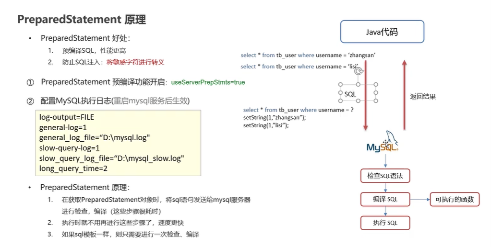

# JDBC

## 链接示例

```java
public class JDBCDemo {
    public static void main(String[] args) throws Exception {
        //1. 注册驱动
        Class.forName("com.mysql.jdbc.Driver");
        //2.获取驱动
        String url = "jdbc:mysql://localhost:3306/mydb2?useUnicode=true&characterEncoding=utf8&useSSL=false";
        String username = "root";
        String password = "ykn12345";
        Connection coon = DriverManager.getConnection(url, username, password);

        //3.定义sql,有没有分号都一样
        String sql = "UPDATE product3 SET product_count = 1000 WHERE category_id ='c001'";

        //获取执行SQL的对象statement
        Statement stmt = coon.createStatement();

        //5.执行sql
        int count = stmt.executeUpdate(sql);//受影响的行数

        //处理结果
        System.out.println(count);

        //7.释放资源
        stmt.close();
        coon.close();
    }
}

```

## DriverManager 驱动管理

里面都是静态方法,作用:

1. 注册驱动
   ```Class.forName("com.mysql.jdbc.Driver");```
   MySQL 5 之后的驱动包可以省略驱动注册的步骤
2. 获取链接
   ```static Connection getConnection(String url,String user,String password)```
    + 参数
        + url:连接路径<br>
          > 语法:jdbc:mysql://ip地址:端口号/数据库名称?参数键值对1&参数键值对2<br>
          jdbc:mysql://127.0.0.1:3306/db1<br>
          配置useSSL=false 参数,禁用安全连接的方式,解决警示提示<br>
        + user 用户名
        + password 密码

## Connection 数据库连接对象

1. 获取执行SQL的对象
    * 普通执行SQL对象<br>
      ```Statement createStatement()```
    * 预编译SQL的执行SQL对象:防止SQL注入<br>
      ```PreparedStatement prepareStatement(sql)```
    * 执行存储过程的对象<br>
      ```CallableStatement prepareCall(sql)//在MySQL中存储过程用的不多```
2. 事务管理
   * MySQL事务管理
   > 开启事务: BEGIN;/START TRANSACTION<br>
   > 提交事务: COMMIT<br>
   > 回滚事务: ROLLBACK<br>
   > mysql 默认自动提交事务<br>
   * JDBC事务管理: Connection接口中定义了3个相对应的方法
   > 开启事务:setAutoCommit(boolean autoCommit):true为自动提交事务,false为手动提交事务即为开启事务<br>
   > 提交事务:commit();<br>
   > 回滚事务:rollback();<br>

## Statement
* statement 作用
  1. 执行SQL语句
* 执行SQL语句
  > int executeUpdate(sql):执行DML、DDL语句<br>
  > 返回值：（1）DML返回影响的行数（2）DDL执行后，执行成功也有可能返回0<br>
  > <br><br>
  > ResultSet executeQuery(sql):执行DQL语句<br>
  > 返回值:ResultSet结果集对象<br>
##ResultSet 
* ResultSet(结果集对象)作用
  1. 封装了DQL查询语句的结果
  > ResultSet stmt.executeQuery(sql):执行DQL语句,返回ResultSet对象<br>
* 获取查询结果
  > boolean next():(1)将光标从当前的位置向前移动一行(2)判断当前行是否为有效行<br>
  > 返回值:<br>true: 有效行,当前行有数据      <br>false:无效行,当前行没有数据<br>

  > xxx getXxx(参数):获取数据<br>
  > xxx: 数据类型:如int getInt(参数);String getString(参数)<br>
  > 参数:<br>
  >  1.int :列的编号,从1开始<br>
  >  2.String:列的名称<br>
 ```java
    ResultSet resultSet = stmt.executeQuery(sql);
    //处理结果
    while (resultSet.next()) {
    //            String pid = resultSet.getString(1);
    //            String name = resultSet.getString(2);
    //            double price = resultSet.getDouble(3);
    int id = resultSet.getInt("pid");
    String name = resultSet.getString("pname");
    double price = resultSet.getDouble("price");
    System.out.println(id + "--" + name + "--" + price);
    }
```
## PreparedStatement 
* PreparedStatement作用
    1. 预编译SQL语言并执行:预防SQL注入问题
  > //SQL语句中的参数值,使用?占位符替代<br>
  > String sql = "select * from user where username = ? and password = ?";<br>
  > <br>
  > //通过Connection对象获取,并传入对应的sql语句<br>
  > PreparedStatement pstmt = conn.prepareStatement(sql);<br>
    
    2. 设置参数值
  > PreparedStatement对象:setXxx(参数1,参数2):给?赋值<br>
  > 参数:<br>
  > 1.参数1:?的位置编号,从1开始<br>
  > 2.参数2:?的值<br>
    3. 执行SQL
  > executeUpdate();/executeQuery;:不需要再传递sql<br>
* SQL注入
  * SQL注入是通过操作输入来修改实现定义好的SQL语句,用以达到执行代码对服务期进行攻击的方法


## jdbc连接池


### 1  数据库连接池简介

> * 数据库连接池是个容器，负责分配、管理数据库连接(Connection)
>
> * 它允许应用程序重复使用一个现有的数据库连接，而不是再重新建立一个；
>
> * 释放空闲时间超过最大空闲时间的数据库连接来避免因为没有释放数据库连接而引起的数据库连接遗漏
> * 好处
> > * 资源重用
> > * 提升系统响应速度
> > * 避免数据库连接遗漏

之前我们代码中使用连接是没有使用都创建一个Connection对象，使用完毕就会将其销毁。这样重复创建销毁的过程是特别耗费计算机的性能的及消耗时间的。 

连接池是在一开始就创建好了一些连接（Connection）对象存储起来。用户需要连接数据库时，不需要自己创建连接，而只需要从连接池中获取一个连接进行使用，使用完毕后再将连接对象归还给连接池；这样就可以起到资源重用，也节省了频繁创建连接销毁连接所花费的时间，从而提升了系统响应的速度。

### 2  数据库连接池实现

* 标准接口：==DataSource==

  官方(SUN) 提供的数据库连接池标准接口，由第三方组织实现此接口。该接口提供了获取连接的功能：

  ```java
  Connection getConnection()
  ```

  那么以后就不需要通过 `DriverManager` 对象获取 `Connection` 对象，而是通过连接池（DataSource）获取 `Connection` 对象。


* Druid（德鲁伊）

    * Druid连接池是阿里巴巴开源的数据库连接池项目

    * 功能强大，性能优秀，是Java语言最好的数据库连接池之一

### 3  Druid使用

> * 导入jar包 druid-1.1.12.jar
> * 定义配置文件
> * 加载配置文件
> * 获取数据库连接池对象
> * 获取连接

**小技巧**:如果不清楚自己的工作路径,即相对路径不知道从哪里写起,
则使用``System.out.println(System.getProperty("user.dir"));``
使用druid的代码如下：

```java
/**
 * Druid数据库连接池演示
 */
public class DruidDemo {

    public static void main(String[] args) throws Exception {
        //1.导入jar包
        //2.定义配置文件
        //3. 加载配置文件
        Properties prop = new Properties();
        prop.load(new FileInputStream("jdbc_demo/src/druid.properties"));
        //4. 获取连接池对象
        DataSource dataSource = DruidDataSourceFactory.createDataSource(prop);

        //5. 获取数据库连接 Connection
        Connection connection = dataSource.getConnection();
        System.out.println(connection); //获取到了连接后就可以继续做其他操作了

        //System.out.println(System.getProperty("user.dir"));
    }
}
```

  